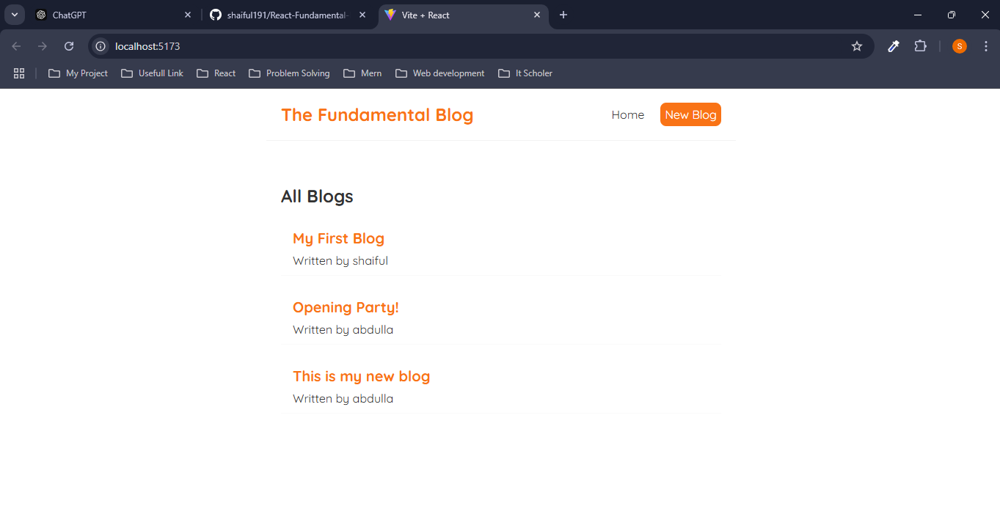
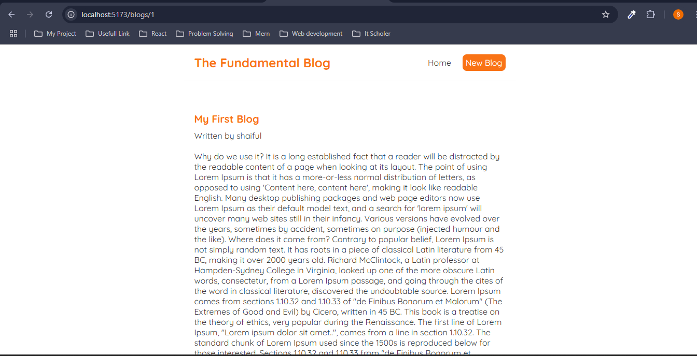
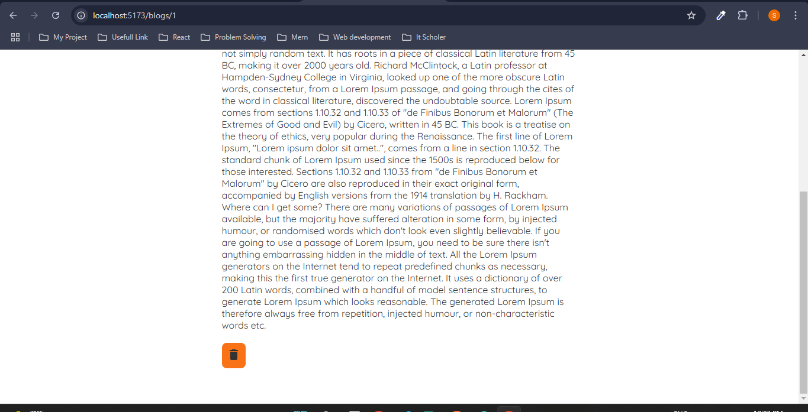
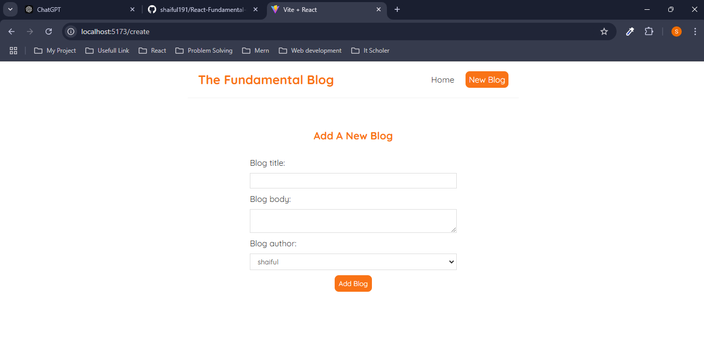
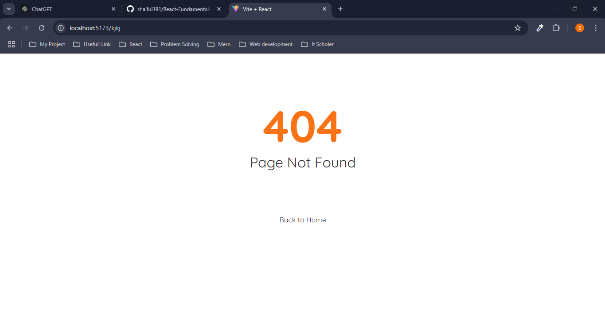

# React Blog Project

## Overview
This is a simple React-based blogging platform that demonstrates CRUD operations. The application allows users to create, read, and delete blog posts. It uses **React Router** for navigation, **React Icons** for UI elements, and a custom **useFetch** hook to fetch data from a JSON server.

## Features
- **Home Page**: Displays all blogs fetched from a JSON server.
- **Create Blog**: Form to create a new blog post with title, body, and author.
- **View Blog Details**: Detailed view of a specific blog.
- **Delete Blog**: Remove a blog post from the database.
- **404 Page**: Custom page for undefined routes.

## Tech Stack
- **Frontend**: React.js
- **Routing**: React Router (v7.1.1)
- **Icons**: React Icons (v5.4.0)
- **Backend**: JSON Server (for testing APIs)

## Project Structure

   ```bash
   react-blog-project/
├── src/
│   ├── components/
│   │   ├── BlogDetails.js
│   │   ├── BlogList.js
│   │   ├── Create.js
│   │   ├── Home.js
│   │   ├── Navbar.js
│   │   └── NotFound.js
│   ├── CustomHooks/
│   │   └── useFetch.js
│   ├── layouts/
│   │   └── Layout.js
│   ├── AppRoutes.js
│   └── App.js
├── data/
│   └── db.json
├── public/
├── package.json
└── README.md

```


## Usage
### Creating a Blog Post
1. Navigate to the **Add Blog** page.
2. Fill out the form fields (title, body, author) and submit.
3. The blog post will appear on the Home page.

### Viewing Blog Details
- Click on a blog title to view its details.

### Deleting a Blog Post
- In the blog details view, click the delete button to remove the blog.

## Custom Hook: `useFetch`
The custom `useFetch` hook is used to fetch data from an API. It supports aborting fetch requests to avoid memory leaks.

```javascript
const { data, isLoaded, error } = useFetch("http://localhost:8000/blogs");
```

## Style

The project uses a responsive design with modern CSS styling. Fonts are imported from Google Fonts, and a warm orange theme is used for highlights.

## Screenshots
- Home Page

- Blog Details Page



- Add Blog Page


- Not Found Page


## Author
Shaiful Islam

## License
This project is licensed under the MIT License.
